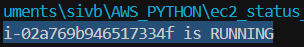

# EC2 Status Checker

A hands-on Python project to explore AWS EC2, automation, and cloud best practices. This script helps you **learn AWS services**, **practice Python automation**, and understand **DevOps principles** like monitoring, cost-awareness, and scripting infrastructure tasks.

---

## Project Overview

This project demonstrates how to interact with **AWS EC2** using Python and **Boto3**.  
It is designed for learners and DevOps enthusiasts who want to:

- Explore AWS services programmatically.
- Automate cloud tasks using Python.
- Understand instance lifecycle and cost implications.
- Practice real-world DevOps scripting.

**Key skills you’ll practice:**

- AWS EC2 management
- Python scripting for cloud automation
- Using Boto3 to call AWS APIs
- Monitoring resources and cost awareness
- Structuring scripts for DevOps pipelines

---

## Prerequisites

- Python 3.x
- `boto3` library
```
pip install boto3
```
AWS account with configured credentials:
---
aws configure
Or via environment variables:

export AWS_ACCESS_KEY_ID=YOUR_KEY
export AWS_SECRET_ACCESS_KEY=YOUR_SECRET

How to Use
-
Clone the repository:
```
git clone https://github.com/siv-the-programmer/Ec2_status_checker.git
cd ec2_status_check
```
Run the script:
```
python main.py
```
The output would look like : 
--


Please see the explanation.py file for a full documentated explanation of how the script works.


